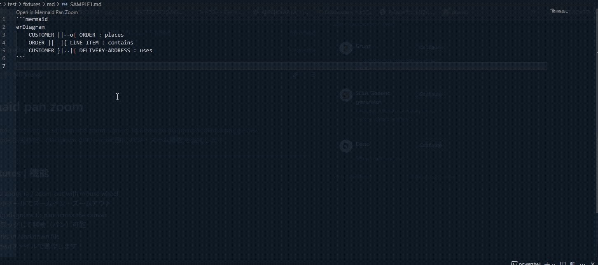
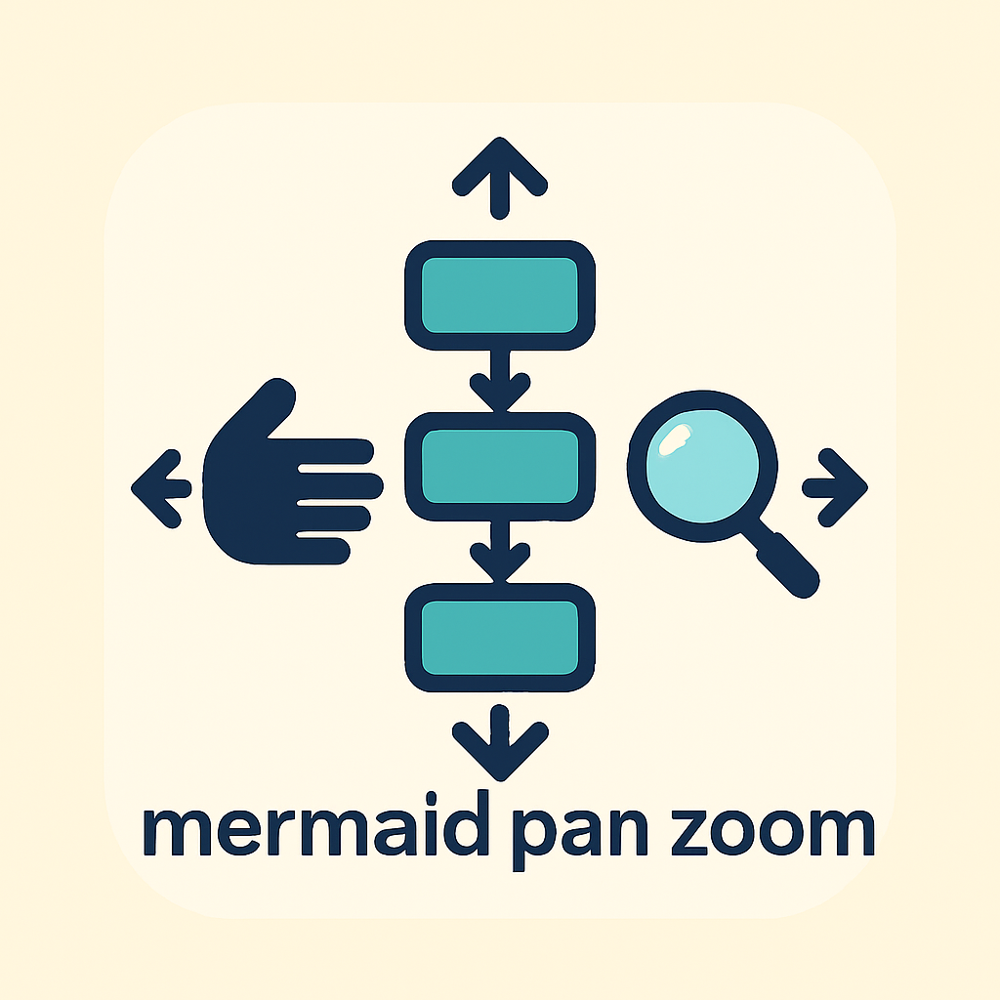

# mermaid pan zoom

> 🐬 VS Code extension to add **pan** and **zoom** support to Mermaid diagrams in Markdown preview.  
> 🐬 VS Code 拡張機能：Markdown の Mermaid 図に **パン・ズーム機能** を追加します。



---

## 📷 Features | 機能

- 🔍 Add zoom-in / zoom-out with mouse wheel  
  マウスホイールでズームイン・ズームアウト
- ✋ Drag diagrams to pan across the canvas  
  図をドラッグして移動（パン）可能
- ⚡️ Works in Markdown file  
  Markdownファイルで動作します

---



## 🚀 Installation | インストール

1. Open Visual Studio Code  
   Visual Studio Code を開きます
2. Go to the Extensions panel (`Ctrl+Shift+X`)  
   拡張機能パネルを開きます（`Ctrl+Shift+X`）
3. Search for `mermaid-pan-zoom` and install  
   `mermaid-pan-zoom` を検索してインストールします

> 💡 You can also install via CLI:  
> 💡 以下の CLI でもインストールできます：
>
> ```bash
> code --install-extension TOnodera.mermaid-pan-zoom
> ```

---

## ✨ Usage | 使い方

1. Open a Markdown (`.md`) file with Mermaid diagram code  
   Mermaid 図を含む Markdown ファイル（`.md`）を開きます
2. Click "Open in Mermaid Pan Zoom"  
   「Open in Mermaid Pan Zoom」をクリックしてください。  
   ✅ Now you can pan and zoom your diagrams freely!  
   ✅ Mermaid 図を自由に拡大・縮小・移動できます！

---


---

## 📄 License

[MIT License](./LICENSE)

---

## 🌐 Links

- GitHub: [https://github.com/TOnodera/mermaid-pan-zoom](https://github.com/TOnodera/mermaid-pan-zoom)
- Issues: [https://github.com/TOnodera/mermaid-pan-zoom/issues](https://github.com/TOnodera/mermaid-pan-zoom/issues)

---

> Made with ❤️ by [TOnodera](https://github.com/TOnodera)

---
